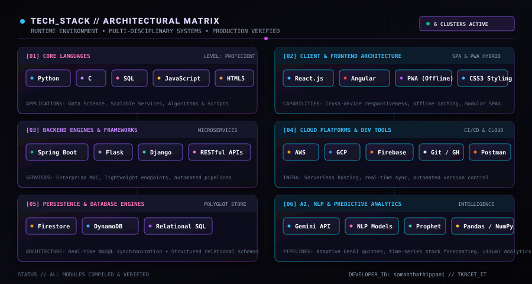
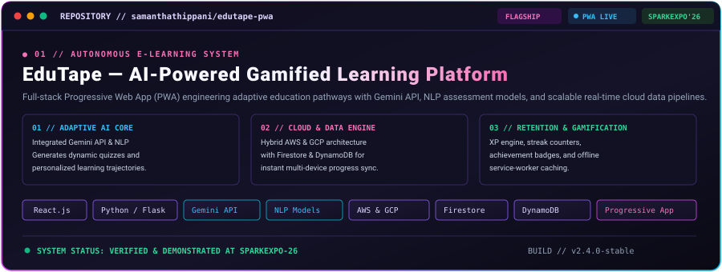
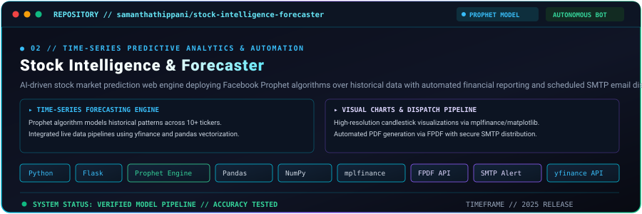
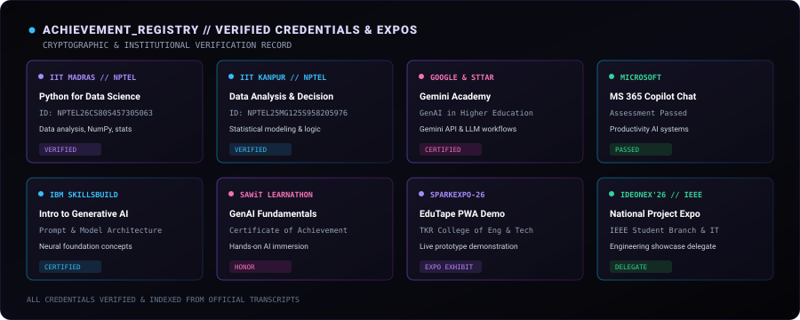

<div align="center">

<!-- ═══════════════════════════════════════════════════════════════════
     NEON NOIR // DEVELOPER OS — CORE HERO CENTERPIECE
     ═══════════════════════════════════════════════════════════════════ -->


<br/>

<!-- SYSTEM TELEMETRY HUD STRIP -->
<table align="center" width="100%">
  <tr>
    <td align="center" width="20%"><code>🟢 CORE_OS: ONLINE</code></td>
    <td align="center" width="20%"><code>⚡ RUNTIME: HYBRID_SPA</code></td>
    <td align="center" width="20%"><code>☁️ CLOUD: AWS • GCP</code></td>
    <td align="center" width="20%"><code>🤖 AI_ENGINE: GEMINI_API</code></td>
    <td align="center" width="20%"><code>📍 NODE: HYDERABAD, IN</code></td>
  </tr>
</table>


</div>

<!-- ═══════════════════════════════════════════════════════════════════
     01 — HACKER TERMINAL INITIALIZATION
     ═══════════════════════════════════════════════════════════════════ -->

### `> ./sys_terminal --stream`

```bash
developer@github:~$ whoami
> samantha.thippani // full-stack developer & ai systems builder

developer@github:~$ git status
> On branch main
> Your branch is up to date with 'origin/main'.
> Changes staged: 2 production projects, 8 verified credentials, full-stack microservices

developer@github:~$ python -m edutape.serve --mode=production
> [2026-09-09 18:00:00] [BOOT] Initializing Gemini API & NLP pipelines... [DONE]
> [2026-09-09 18:00:01] [CLOUD] DynamoDB & Firestore real-time sync active... [DONE]
> [2026-09-09 18:00:02] [PWA] Progressive service-worker cache primed... [ONLINE]
> [STATUS] System operational. Ready for deployment.
```


<!-- ═══════════════════════════════════════════════════════════════════
     02 — WHO AM I
     ═══════════════════════════════════════════════════════════════════ -->

### `> ./whoami`

<table>
  <tr>
    <td width="65%" valign="top">

```yaml
IDENTITY_SPEC:
  name: "Samantha Thippani"
  role: "Full Stack Developer • AI Systems Builder"
  education:
    degree: "B.Tech in Information Technology"
    institution: "TKR College of Engineering and Technology, Hyderabad"
    timeline: "2023 – 2027"
    academic_metric: "CGPA: 7.0 / 10.0"
  location: "Hyderabad, India"
  status: "🟢 Actively Building & Seeking Software Engineering Opportunities"
  core_competencies:
    - "Full-stack web applications with React.js, Angular, Spring Boot & Python"
    - "AI integration: Generative AI APIs (Gemini), NLP models & predictive time-series"
    - "Cloud-native infrastructure on AWS & GCP with Firestore & DynamoDB"
```

</td>
<td width="35%" valign="top">

#### ◈ ARCHITECTURAL STATEMENT

> *"I engineer resilient full-stack systems and infuse them with artificial intelligence — bridging reactive user interfaces, high-throughput backend services, and machine intelligence into cohesive software products."*

<br/>

- 🚀 **Full-Stack Engineering:** High-performance SPAs and PWAs
- 🤖 **Applied AI & Data:** Predictive modeling, Gemini API & NLP
- ☁️ **Cloud Native:** Scalable architectures on AWS & GCP
- 🏆 **Proven Delivery:** Showcased at SPARKEXPO-26 & IDEONEX'26

</td>
</tr>
</table>


<!-- ═══════════════════════════════════════════════════════════════════
     03 — CURRENT MISSION
     ═══════════════════════════════════════════════════════════════════ -->

### `> ./current_mission`

<table>
  <tr>
    <td width="25%" align="left">
      <div align="center"><code><b>01 // BUILD</b></code></div>
      <br/>
      <b>Intelligent Web Systems</b><br/>
      Engineering reactive full-stack web applications, PWAs, and microservices with modern frontend frameworks and robust Python/Java backends.
    </td>
    <td width="25%" align="left">
      <div align="center"><code><b>02 // LEARN</b></code></div>
      <br/>
      <b>Deepening Data Science</b><br/>
      Advancing knowledge in predictive algorithms, statistical decision-making, and distributed computing through IIT Madras and IIT Kanpur programs.
    </td>
    <td width="25%" align="left">
      <div align="center"><code><b>03 // EXPLORE</b></code></div>
      <br/>
      <b>GenAI &amp; Cloud Fabrics</b><br/>
      Integrating Gemini API, NLP semantic search, and AWS/GCP serverless pipelines to build adaptive, self-learning user experiences.
    </td>
    <td width="25%" align="left">
      <div align="center"><code><b>04 // SHIP</b></code></div>
      <br/>
      <b>Production Products</b><br/>
      Transforming complex technical ideas into verified, demonstrated software products with real-world impact and community adoption.
    </td>
  </tr>
</table>


<!-- ═══════════════════════════════════════════════════════════════════
     04 — TECHNOLOGY MATRIX
     ═══════════════════════════════════════════════════════════════════ -->

### `> ./tech_stack`

<div align="center">
  
</div>

<details>
<summary><b>▸ View Raw Dependency &amp; Framework Manifest (JSON)</b></summary>

```json
{
  "system_manifest": {
    "languages": ["Python", "C", "SQL", "HTML5", "JavaScript"],
    "frontend_architecture": ["React.js", "Angular", "Progressive Web Apps (PWA)", "CSS3"],
    "backend_frameworks": ["Spring Boot", "Flask", "Django", "RESTful APIs"],
    "cloud_and_infrastructure": ["Amazon Web Services (AWS)", "Google Cloud Platform (GCP)", "Firebase"],
    "database_systems": ["Amazon DynamoDB", "Google Cloud Firestore", "Relational SQL"],
    "ai_ml_data_science": ["Google Gemini API", "NLP Models", "Facebook Prophet", "Pandas", "NumPy", "Matplotlib", "mplfinance"],
    "developer_toolchain": ["Git", "GitHub", "VS Code", "Postman", "FPDF", "SMTP Automation"]
  }
}
```

</details>


<!-- ═══════════════════════════════════════════════════════════════════
     05 — PROJECT UNIVERSE
     ═══════════════════════════════════════════════════════════════════ -->

### `> ./projects --scope=all`

<!-- FLAGSHIP PROJECT 01 -->
<div align="center">
  
</div>

<br/>

<table>
  <tr>
    <td width="33%">
      <b>🧠 Adaptive Intelligence</b><br/>
      Leverages Gemini API and Natural Language Processing to generate real-time adaptive quiz questions, tailored study pathways, and contextual explanations based on user performance.
    </td>
    <td width="33%">
      <b>☁️ Cloud &amp; Real-Time Data</b><br/>
      Built resilient cloud infrastructure across AWS and GCP, using Firestore and DynamoDB to enable sub-second user state synchronization across concurrent devices.
    </td>
    <td width="33%">
      <b>🎮 Gamification &amp; PWA</b><br/>
      Engineered as a Progressive Web App with offline service-worker caching, interactive badge milestones, XP rewards, and global competitive leaderboards.
    </td>
  </tr>
</table>

<br/>

<!-- SECONDARY PROJECT 02 -->
<div align="center">
  
</div>

<br/>

<table>
  <tr>
    <td width="50%">
      <b>📈 Algorithmic Forecasting</b><br/>
      Deploys the Facebook Prophet additive time-series model to forecast multi-ticker equity price movements, evaluating historical pricing with automated seasonality detection.
    </td>
    <td width="50%">
      <b>📬 Automated Reporting &amp; Alerts</b><br/>
      Integrates yfinance for live data extraction, mplfinance for candlestick chart generation, and automated FPDF document rendering delivered via scheduled SMTP email dispatches.
    </td>
  </tr>
</table>


<!-- ═══════════════════════════════════════════════════════════════════
     06 — GITHUB TELEMETRY & MONITORING DASHBOARD
     ═══════════════════════════════════════════════════════════════════ -->

### `> ./github_telemetry --realtime`

<div align="center">

<table border="0">
  <tr>
    <td valign="top" width="50%">
      
    </td>
    <td valign="top" width="50%">
      
    </td>
  </tr>
  <tr>
    <td colspan="2" align="center">
      
    </td>
  </tr>
</table>

</div>


<!-- ═══════════════════════════════════════════════════════════════════
     07 — ENGINEERING JOURNEY (GIT COMMIT TIMELINE)
     ═══════════════════════════════════════════════════════════════════ -->

### `> ./journey --graph --oneline`

<div align="center">
  
</div>


<!-- ═══════════════════════════════════════════════════════════════════
     08 — ACHIEVEMENT & CREDENTIAL DATABASE
     ═══════════════════════════════════════════════════════════════════ -->

### `> ./achievements --verified`

<div align="center">
  
</div>

<details>
<summary><b>▸ View Detailed Credential Index &amp; Academic Milestones</b></summary>
<br/>

| Organization | Certification / Milestone | Credential / Event Details |
| :--- | :--- | :--- |
| **IIT Madras (NPTEL)** | Python for Data Science | ID: `NPTEL26CS80S457305063` (May 2026) |
| **IIT Kanpur (NPTEL)** | Data Analysis and Decision Making | ID: `NPTEL25MG125S958205976` (Nov 2025) |
| **Google &amp; STTAR** | Gemini Academy – Higher Education with Google Gemini | Certified Workshop (Oct 2025) |
| **Microsoft** | Microsoft 365 Copilot Chat | Module Assessment Passed (Mar 2026) |
| **IBM SkillsBuild** | Introduction to Generative AI | Verified Certificate (Aug 2025) |
| **SAWiT AI Learnathon** | Generative AI Fundamentals | Certificate of Achievement (Jul 2025) |
| **Innomatics Research Labs** | 5-Day Machine Learning Workshop | Hands-on ML Practicum (Jun 2025) |
| **UptoSkills** | AI Content Creation &amp; Video Engineering | Internship Certificate (Feb 2026 – May 2026) |
| **SPARKEXPO-26** | EduTape AI Gamified Learning Platform | Project Showcase at TKRCET (2026) |
| **IDEONEX'26** | National Level Project Expo | IT Dept &amp; IEEE Student Branch Exhibition |
| **AI Impact Summit** | Mission Upskill India Pre-Summit | Industry Exposure &amp; AI Applications |

</details>


<!-- ═══════════════════════════════════════════════════════════════════
     09 — SECURE CONNECTION / HANDSHAKE
     ═══════════════════════════════════════════════════════════════════ -->

### `> ./connect --tls-handshake`

```text
┌─────────────────────────────────────────────────────────────────────────────┐
│  SECURE CONNECTION REQUEST // ESTABLISH DIRECT COMMUNICATION CHANNEL        │
└─────────────────────────────────────────────────────────────────────────────┘
```

<table align="center" width="100%">
  <tr>
    <td align="center" width="25%">
      <a href="https://github.com/samanthathippani">
        <code><b>[ GITHUB ]</b></code><br/>
        <sub>github.com/samanthathippani</sub>
      </a>
    </td>
    <td align="center" width="25%">
      <a href="https://linkedin.com/in/samanthathippani">
        <code><b>[ LINKEDIN ]</b></code><br/>
        <sub>linkedin.com/in/samanthathippani</sub>
      </a>
    </td>
    <td align="center" width="25%">
      <a href="mailto:thippanicherry@gmail.com">
        <code><b>[ ENCRYPTED EMAIL ]</b></code><br/>
        <sub>thippanicherry@gmail.com</sub>
      </a>
    </td>
    <td align="center" width="25%">
      <a href="https://maps.google.com/?q=Hyderabad,+India">
        <code><b>[ BASE STATION ]</b></code><br/>
        <sub>Hyderabad, India (IST / UTC+5:30)</sub>
      </a>
    </td>
  </tr>
</table>

<br/>

<!-- ═══════════════════════════════════════════════════════════════════
     10 — TERMINAL FOOTER
     ═══════════════════════════════════════════════════════════════════ -->

<div align="center">
  
</div>
